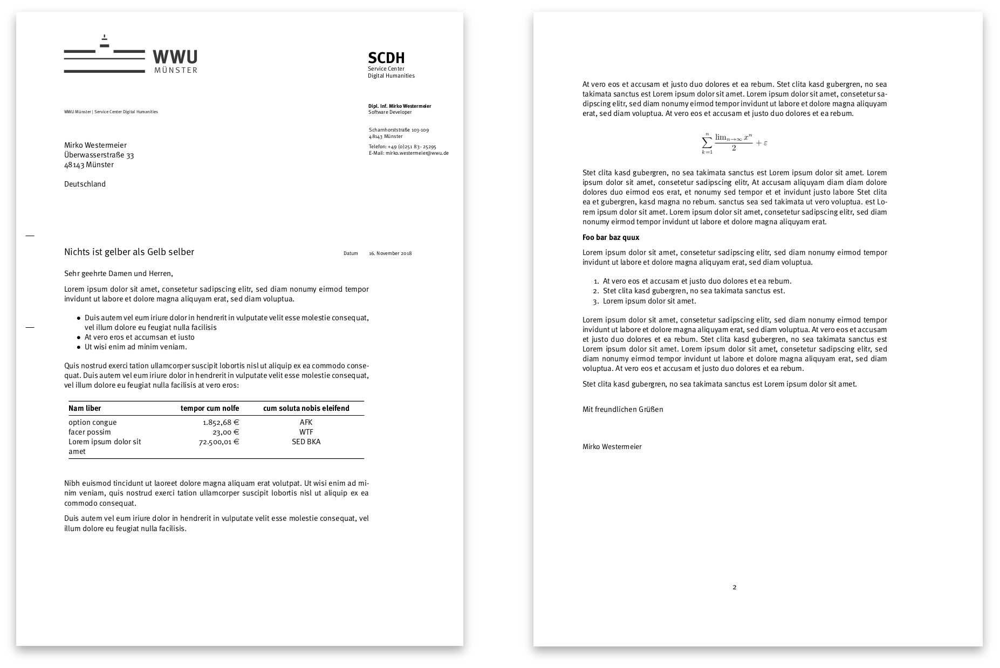

Docker configurations for my development environment
====================================================

[](https://travis-ci.org/memowe/dev-environment)

## Preparations

```bash
$ make init
```

This updates all submodules and builds a vim package that needs compilation.

## Usage

Cache/build docker images:

```bash
$ make
```

Run it (with data):

```bash
$ make run
$ MOUNT=$HOME make run
```

Run it, but don't attach:

```bash
$ MOUNT=$HOME make detached
```

Test it:

```bash
$ make test
```

Have a look at the [build targets](Makefile) for more information.

## Contents

- **[base](base/Dockerfile)**
    - Installation of important stuff like git/vim etc.

- **[perl](perl/Dockerfile)**
    - Perl environment with modules important for me

- **[python](python/Dockerfile)**
    - Python programming environment with an emphasis on web apps

- **[docs](docs/Dockerfile)**
    - LaTeX/Pandoc for documents

- **[wwu](wwu/Dockerfile)**
    - [WWU][] corporate identity files in `/usr/share/wwu`
    - Convenience script `wwubrief` for markdown compilation

- **[user](user/Dockerfile)**
    - vim etc. configuration

[WWU]: https://www.wwu.de

All this is orchestrated by a funky [Makefile](Makefile).



## Author

(c) 2018 [Mirko Westermeier](http://mirko.westermeier.de/)

All rights reserved.

**Contributors**

- Diego Siqueira

## Resources

- [Docker Docs: **Dockerfile reference**][df-reference]
- [Docker Docs: **Dockerfile best practices**][docker-bp]
- [Jakub Skałecki: **How to write excellent Dockerfiles**][skalecki]
- [Docker Docs: **Multistage builds**][multistage]
- [Docker Docs: **docker-compose**][compose]
- [Jannis Hermanns: **The iPad Pro as main computer for programming**][hermanns]
    - [his `Dockerfile`][hermanns-df]

[df-reference]: https://docs.docker.com/engine/reference/builder/
[docker-bp]: https://docs.docker.com/develop/develop-images/dockerfile_best-practices/
[skalecki]: https://rock-it.pl/how-to-write-excellent-dockerfiles/
[multistage]: https://docs.docker.com/develop/develop-images/multistage-build/
[compose]: https://docs.docker.com/compose/
[hermanns]: https://jann.is/ipad-pro-for-programming/
[hermanns-df]: https://github.com/jayniz/zsh-tmux-neovim-docker/blob/master/Dockerfile
